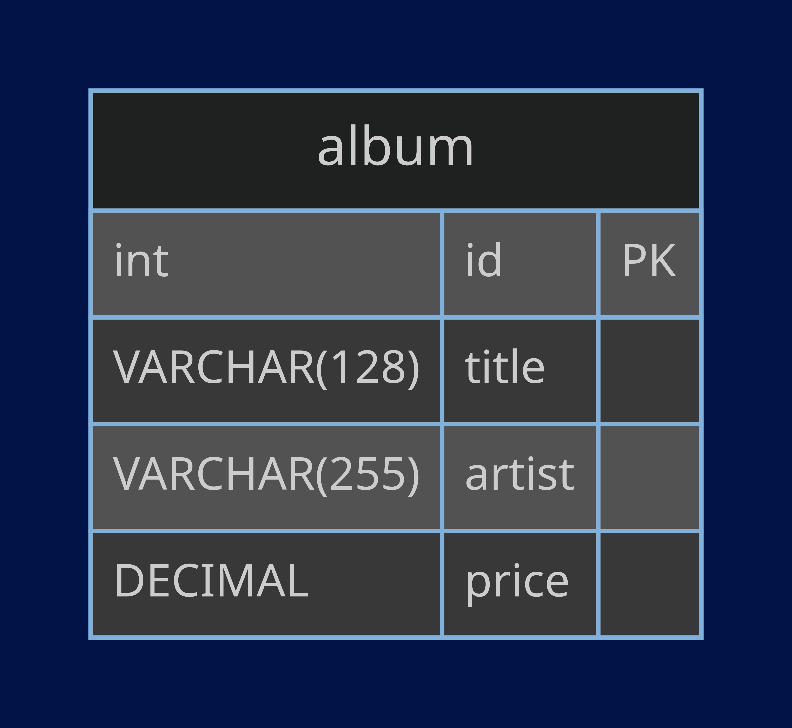

# GoLang SQL Tutorial

## Description
This is an implementation and extension of the sample program the tutorial on how to access a relational database using Go, featured in Go's documentation [here](https://go.dev/doc/tutorial/database-access).

The example aims to model a collection of albums with the follwoing attributes, and offers basic CRUD functionality for the database.

The example models a database with the following schema:


## Features
The basic functionality offered by the documentation includes:
- `albumsByArtist`, a method that offers read functionality, and returns albums that have an artist that matches the passed in string value.
- `albumByID`, a method that offers read functionality, and returns the album which has the specified ID.
- `addAlbum`, a methood that offers the creation functionality, and returns the ID of the newly inserted album.

In addition to these basic functionalities, I wrote 3 additional methods to implement the full creation, reading, updating and deletion functionalities of a database.

The additional methods written were:
- `deleteAlbum`, a method that offers the deletion functionality, and returns the ID of the removed album.
- `viewAlbums`, a method that offers the read functionality by returning all albums in the database.
- `updateAlbum`, a method that offers the functionality of updating an album with a specified ID with the album passed in by the user.

## Running the Project

1. Clone the repository into the system you want to run this on.
2. Ensure that MySQL is installed on the system.
3. Log in to MySQL and run:
   ```
   create database recordings;
   ```
   to create the database;
   ```
   use recordings;
   ```
   so you can add tables to it, and;
   ```
   source create-tables.sql;
   ```
   so you create an album table with sample data to test the code.
4. To test the code, change your working directory to `data-access` and enter:
   ```
   export DBUSER=username
   export DBPASS=password
   ```
   and replace username and password with your MySQL username and password so the program can run.
5. Next, run the following line of code to test the code!
   ```
   go run .
   ```
